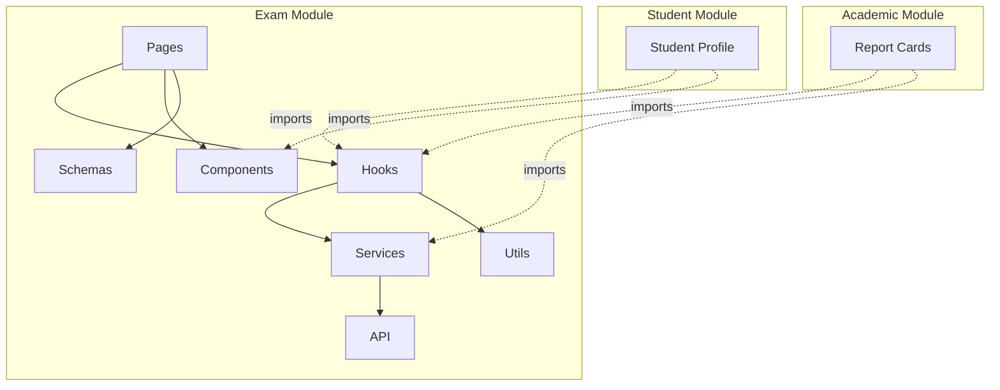
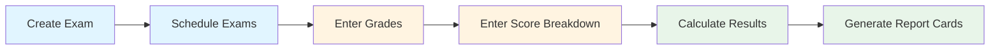
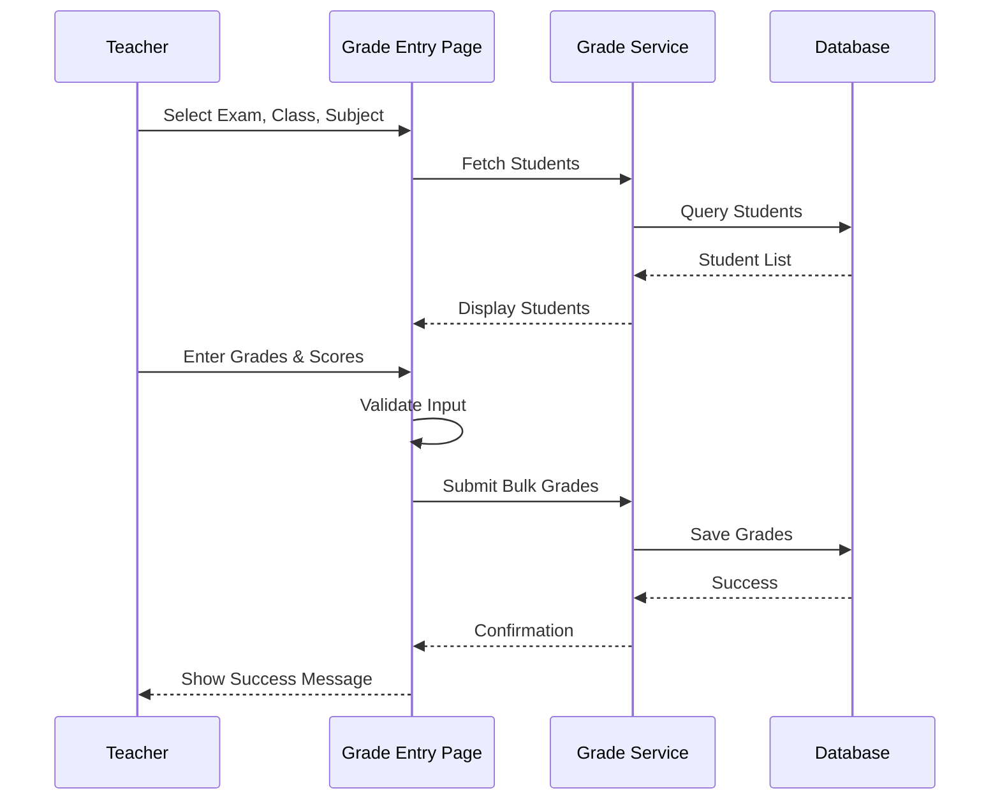
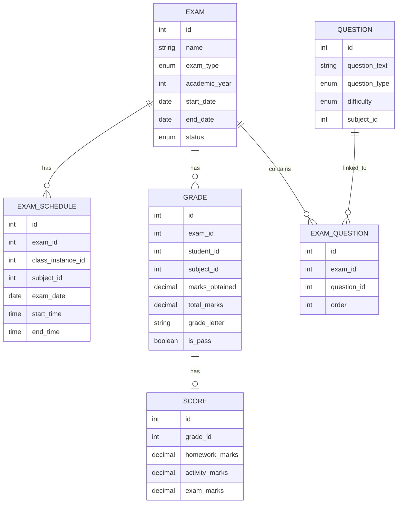

# Exam Module Architecture Plan

## Overview
Create a standalone **Exam Module** (`src/mis/modules/exam`) to manage all examination-related functionality, separating it from the academic module. This module will handle exams, grades, scores, exam schedules, and optionally exam questions.

---

## Requirements Summary

### Core Features
1. **Exams Management**
   - Two exam types per academic year: **Midterm** and **Final**
   - Midterm: 40 marks total
   - Final: 60 marks total
   - Total: 100 marks per subject

2. **Score Structure**
   - **Midterm (40 marks)**:
     - Homework: 2 marks
     - Class Activity: 2 marks
     - Exam: 36 marks
   
   - **Final (60 marks)**:
     - Homework: 3 marks
     - Class Activity: 3 marks
     - Exam: 54 marks

3. **Grades & Scores**
   - Track individual student performance per subject
   - Calculate letter grades (A+, A, A-, B+, B, B-, C+, C, C-, D, F)
   - Track pass/fail status
   - Support bulk grade entry

4. **Exam Schedule**
   - Schedule exams per subject with date and time
   - A class can have 1-6 exams per day (typically 1)
   - Track exam duration
   - Conflict detection

5. **Exam Questions (Optional)**
   - Basic question bank feature
   - Link questions to exams
   - Support multiple question types
   - Lightweight implementation

---

## Module Structure

```
src/mis/modules/exam/
├── index.ts                          # Module exports
├── types.ts                          # TypeScript type definitions
├── constants.ts                      # Constants and enums
│
├── components/                       # Reusable components
│   ├── ExamCard.tsx                 # Exam display card
│   ├── ScoreBreakdown.tsx           # Score breakdown display
│   ├── GradeEntryTable.tsx          # Bulk grade entry table
│   ├── ExamScheduleCalendar.tsx     # Exam schedule calendar view
│   └── QuestionBankModal.tsx        # Question bank modal (optional)
│
├── pages/                            # Page components
│   ├── ExamList.tsx                 # List all exams
│   ├── ExamForm.tsx                 # Create/Edit exam
│   ├── ExamDetail.tsx               # View exam details & results
│   ├── GradeEntry.tsx               # Bulk grade entry
│   ├── GradeList.tsx                # View all grades
│   ├── ScoreEntry.tsx               # Score breakdown entry
│   ├── ExamScheduleList.tsx         # List exam schedules
│   ├── ExamScheduleForm.tsx         # Create/Edit exam schedule
│   ├── ExamScheduleCalendar.tsx     # Calendar view of schedules
│   └── QuestionBank.tsx             # Question bank (optional)
│
├── hooks/                            # React Query hooks
│   ├── useExams.ts                  # Exam CRUD operations
│   ├── useGrades.ts                 # Grade operations
│   ├── useScores.ts                 # Score operations
│   ├── useExamSchedules.ts          # Exam schedule operations
│   └── useQuestions.ts              # Question bank (optional)
│
├── services/                         # API services
│   ├── examService.ts               # Exam API calls
│   ├── gradeService.ts              # Grade API calls
│   ├── scoreService.ts              # Score API calls
│   ├── examScheduleService.ts       # Exam schedule API calls
│   └── questionService.ts           # Question bank API (optional)
│
├── schemas/                          # Zod validation schemas
│   ├── examSchemas.ts               # Exam validation
│   ├── gradeSchemas.ts              # Grade validation
│   ├── scoreSchemas.ts              # Score validation
│   ├── scheduleSchemas.ts           # Schedule validation
│   └── questionSchemas.ts           # Question validation (optional)
│
└── utils/                            # Utility functions
    ├── gradeCalculations.ts         # Grade calculation logic
    ├── scoreCalculations.ts         # Score calculation logic
    └── examHelpers.ts               # Helper functions
```

---

## Type Definitions

### Core Types

```typescript
// Exam Types
export type ExamType = 'midterm' | 'final';
export type ExamStatus = 'draft' | 'scheduled' | 'in_progress' | 'completed' | 'cancelled';

export interface ExamApiResponse {
  id: number;
  name: string;
  display_name: string;
  exam_type: ExamType;
  exam_type_display: string;
  academic_year: number;
  academic_year_display: string;
  start_date: string;
  end_date: string;
  status: ExamStatus;
  status_display: string;
  
  // Marks configuration
  total_marks: number;
  pass_percentage: number;
  
  // Statistics
  scheduled_count: number;
  completed_count: number;
  grade_count: number;
  
  // Metadata
  is_upcoming: boolean;
  is_ongoing: boolean;
  is_past: boolean;
  created_at: string;
  updated_at: string;
}

export interface CreateExamData {
  name: string;
  exam_type: ExamType;
  academic_year: number;
  class_levels?: number[];
  class_instances?: number[];
  start_date: string;
  end_date: string;
  total_marks?: number;
  pass_percentage?: number;
  status?: ExamStatus;
  description?: string;
  notes?: string;
}

// Score Types
export interface ScoreBreakdown {
  homework: number;
  class_activity: number;
  exam: number;
  total: number;
}

export interface ScoreApiResponse {
  id: number;
  grade_id: number;
  exam: number;
  exam_type: ExamType;
  student: number;
  student_name: string;
  subject: number;
  subject_name: string;
  
  // Score breakdown
  homework_marks: number;
  homework_total: number;
  activity_marks: number;
  activity_total: number;
  exam_marks: number;
  exam_total: number;
  
  // Calculated
  total_marks: number;
  total_possible: number;
  percentage: number;
  
  created_at: string;
  updated_at: string;
}

export interface CreateScoreData {
  grade_id: number;
  homework_marks: number;
  activity_marks: number;
  exam_marks: number;
}

// Grade Types (Enhanced)
export type GradeLetter = 'A+' | 'A' | 'A-' | 'B+' | 'B' | 'B-' | 'C+' | 'C' | 'C-' | 'D' | 'F';

export interface GradeApiResponse {
  id: number;
  exam: number;
  exam_name: string;
  exam_type: ExamType;
  student: number;
  student_name: string;
  student_id_number: string;
  subject: number;
  subject_name: string;
  subject_code: string;
  class_instance: number;
  class_instance_name: string;
  
  // Marks
  marks_obtained: number;
  total_marks: number;
  percentage: number;
  grade_letter: GradeLetter;
  
  // Status
  is_pass: boolean;
  is_absent: boolean;
  
  // Score breakdown (if available)
  has_score_breakdown: boolean;
  score_breakdown?: ScoreBreakdown;
  
  remarks?: string;
  created_at: string;
  updated_at: string;
}

// Exam Schedule Types
export interface ExamScheduleApiResponse {
  id: number;
  exam: number;
  exam_name: string;
  class_instance: number;
  class_instance_name: string;
  subject: number;
  subject_name: string;
  subject_code: string;
  
  // Schedule details
  exam_date: string;
  start_time: string;
  end_time: string;
  duration_minutes: number;
  
  // Location
  room?: number;
  room_number?: string;
  room_name?: string;
  
  // Invigilators
  invigilators?: number[];
  invigilator_names?: string[];
  
  // Status
  is_completed: boolean;
  notes?: string;
  
  created_at: string;
  updated_at: string;
}

export interface CreateExamScheduleData {
  exam: number;
  class_instance: number;
  subject: number;
  exam_date: string;
  start_time: string;
  end_time: string;
  room?: number;
  invigilators?: number[];
  notes?: string;
}

// Question Bank Types (Optional)
export type QuestionType = 'multiple_choice' | 'true_false' | 'short_answer' | 'essay' | 'fill_blank';
export type DifficultyLevel = 'easy' | 'medium' | 'hard';

export interface QuestionApiResponse {
  id: number;
  question_text: string;
  question_type: QuestionType;
  difficulty: DifficultyLevel;
  subject: number;
  subject_name: string;
  class_level: number;
  class_level_name: string;
  
  // For multiple choice
  options?: string[];
  correct_answer?: string | number;
  
  // Marks
  marks: number;
  
  // Metadata
  tags?: string[];
  is_active: boolean;
  created_by?: number;
  created_at: string;
  updated_at: string;
}

export interface ExamQuestionLink {
  id: number;
  exam: number;
  question: number;
  question_detail?: QuestionApiResponse;
  order: number;
  marks_override?: number;
}
```

---

## API Endpoints

### Exams
- `GET /api/exams/` - List exams
- `POST /api/exams/` - Create exam
- `GET /api/exams/{id}/` - Get exam details
- `PATCH /api/exams/{id}/` - Update exam
- `DELETE /api/exams/{id}/` - Delete exam
- `GET /api/exams/current-year/` - Get current year exams
- `POST /api/exams/{id}/update-status/` - Update exam status
- `GET /api/exams/{id}/statistics/` - Get exam statistics

### Grades
- `GET /api/grades/` - List grades
- `POST /api/grades/` - Create grade
- `GET /api/grades/{id}/` - Get grade details
- `PATCH /api/grades/{id}/` - Update grade
- `DELETE /api/grades/{id}/` - Delete grade
- `POST /api/grades/bulk-entry/` - Bulk grade entry
- `GET /api/grades/by-class/` - Get grades by class
- `GET /api/grades/student-transcript/` - Get student transcript

### Scores
- `GET /api/scores/` - List scores
- `POST /api/scores/` - Create score breakdown
- `GET /api/scores/{id}/` - Get score details
- `PATCH /api/scores/{id}/` - Update score
- `DELETE /api/scores/{id}/` - Delete score
- `POST /api/scores/bulk-entry/` - Bulk score entry
- `GET /api/scores/by-grade/` - Get score by grade

### Exam Schedules
- `GET /api/exam-schedules/` - List exam schedules
- `POST /api/exam-schedules/` - Create schedule
- `GET /api/exam-schedules/{id}/` - Get schedule details
- `PATCH /api/exam-schedules/{id}/` - Update schedule
- `DELETE /api/exam-schedules/{id}/` - Delete schedule
- `GET /api/exam-schedules/by-exam/` - Get schedules by exam
- `GET /api/exam-schedules/by-class/` - Get schedules by class
- `GET /api/exam-schedules/calendar/` - Get calendar view
- `POST /api/exam-schedules/check-conflicts/` - Check scheduling conflicts

### Questions (Optional)
- `GET /api/questions/` - List questions
- `POST /api/questions/` - Create question
- `GET /api/questions/{id}/` - Get question details
- `PATCH /api/questions/{id}/` - Update question
- `DELETE /api/questions/{id}/` - Delete question
- `GET /api/questions/by-subject/` - Get questions by subject
- `POST /api/exam-questions/` - Link question to exam
- `DELETE /api/exam-questions/{id}/` - Unlink question

---

## Pages & Features

### 1. Exam List Page (`ExamList.tsx`)
**Route:** `/mis/exams`

**Features:**
- Display all exams with filters (academic year, type, status)
- Show exam cards with key information
- Quick actions: View, Edit, Delete
- Status badges (draft, scheduled, in progress, completed)
- Statistics: scheduled exams, completed exams, total grades

**Components:**
- ExamCard
- Filter controls
- Pagination

### 2. Exam Form Page (`ExamForm.tsx`)
**Route:** `/mis/exams/new`, `/mis/exams/{id}/edit`

**Features:**
- Create/Edit exam
- Select exam type (midterm/final)
- Set academic year
- Select class levels/instances
- Set date range
- Configure marks and pass percentage
- Set status

**Validation:**
- Required fields
- Date validation (end >= start)
- Marks validation

### 3. Exam Detail Page (`ExamDetail.tsx`)
**Route:** `/mis/exams/{id}`

**Features:**
- View exam details
- Statistics dashboard
- Grades summary by class
- Subject-wise performance
- Export results
- Navigate to grade entry
- Navigate to exam schedule

**Components:**
- Statistics cards
- Performance charts
- Grade distribution
- Class-wise summary

### 4. Grade Entry Page (`GradeEntry.tsx`)
**Route:** `/mis/exams/grades/entry`

**Features:**
- Select exam, class, subject
- Bulk grade entry table
- Score breakdown entry (homework, activity, exam)
- Auto-calculate totals and percentages
- Mark absent students
- Add remarks
- Save/Update grades
- Validation and error handling

**Components:**
- GradeEntryTable
- ScoreBreakdown
- Student list with input fields

### 5. Grade List Page (`GradeList.tsx`)
**Route:** `/mis/exams/grades`

**Features:**
- View all grades with filters
- Filter by exam, class, subject, student
- Export grades
- Edit individual grades
- View score breakdown

### 6. Score Entry Page (`ScoreEntry.tsx`)
**Route:** `/mis/exams/scores/entry`

**Features:**
- Detailed score breakdown entry
- Separate inputs for homework, activity, exam
- Visual progress indicators
- Validation against max marks
- Bulk entry support

### 7. Exam Schedule List (`ExamScheduleList.tsx`)
**Route:** `/mis/exams/schedules`

**Features:**
- List all exam schedules
- Filter by exam, class, date range
- View schedule details
- Quick actions: Edit, Delete
- Conflict warnings

### 8. Exam Schedule Form (`ExamScheduleForm.tsx`)
**Route:** `/mis/exams/schedules/new`, `/mis/exams/schedules/{id}/edit`

**Features:**
- Create/Edit exam schedule
- Select exam, class, subject
- Set date and time
- Select room
- Assign invigilators
- Conflict detection
- Duration calculation

### 9. Exam Schedule Calendar (`ExamScheduleCalendar.tsx`)
**Route:** `/mis/exams/schedules/calendar`

**Features:**
- Calendar view of exam schedules
- Day/Week/Month views
- Color-coded by subject/class
- Click to view details
- Drag-and-drop rescheduling (future enhancement)

### 10. Question Bank (Optional) (`QuestionBank.tsx`)
**Route:** `/mis/exams/questions`

**Features:**
- List all questions
- Filter by subject, class level, difficulty
- Create/Edit questions
- Link questions to exams
- Preview questions
- Import/Export questions

---

## Component Architecture

### Reusable Components

#### 1. ExamCard
```typescript
interface ExamCardProps {
  exam: ExamApiResponse;
  onView?: (id: number) => void;
  onEdit?: (id: number) => void;
  onDelete?: (id: number) => void;
}
```

#### 2. ScoreBreakdown
```typescript
interface ScoreBreakdownProps {
  examType: ExamType;
  homework: number;
  activity: number;
  exam: number;
  readonly?: boolean;
  onChange?: (breakdown: ScoreBreakdown) => void;
}
```

#### 3. GradeEntryTable
```typescript
interface GradeEntryTableProps {
  students: ClassInstanceStudent[];
  existingGrades?: GradeApiResponse[];
  examType: ExamType;
  totalMarks: number;
  onSave: (grades: BulkGradeEntry[]) => void;
}
```

#### 4. ExamScheduleCalendar
```typescript
interface ExamScheduleCalendarProps {
  schedules: ExamScheduleApiResponse[];
  view: 'day' | 'week' | 'month';
  onScheduleClick?: (schedule: ExamScheduleApiResponse) => void;
}
```

---

## Validation Schemas

### Exam Schema
```typescript
export const examSchema = z.object({
  name: z.string().min(1, 'Exam name is required').max(200),
  exam_type: z.enum(['midterm', 'final']),
  academic_year: z.number().min(1, 'Academic year is required'),
  class_levels: z.array(z.number()).optional(),
  class_instances: z.array(z.number()).optional(),
  start_date: z.string().min(1, 'Start date is required'),
  end_date: z.string().min(1, 'End date is required'),
  total_marks: z.number().min(1).max(1000).default(100),
  pass_percentage: z.number().min(0).max(100).default(40),
  status: z.enum(['draft', 'scheduled', 'in_progress', 'completed', 'cancelled']).default('draft'),
  description: z.string().optional(),
  notes: z.string().optional(),
}).refine((data) => data.start_date <= data.end_date, {
  message: 'End date must be on or after start date',
  path: ['end_date'],
});
```

### Score Schema
```typescript
export const scoreSchema = z.object({
  grade_id: z.number().min(1, 'Grade is required'),
  homework_marks: z.number().min(0),
  activity_marks: z.number().min(0),
  exam_marks: z.number().min(0),
}).refine((data) => {
  // Validate against exam type limits
  return true; // Add specific validation
}, {
  message: 'Marks exceed allowed limits',
});
```

### Exam Schedule Schema
```typescript
export const examScheduleSchema = z.object({
  exam: z.number().min(1, 'Exam is required'),
  class_instance: z.number().min(1, 'Class is required'),
  subject: z.number().min(1, 'Subject is required'),
  exam_date: z.string().min(1, 'Date is required'),
  start_time: z.string().min(1, 'Start time is required'),
  end_time: z.string().min(1, 'End time is required'),
  room: z.number().optional(),
  invigilators: z.array(z.number()).optional(),
  notes: z.string().optional(),
}).refine((data) => {
  // Validate time range
  return data.start_time < data.end_time;
}, {
  message: 'End time must be after start time',
  path: ['end_time'],
});
```

---

## Utility Functions

### Grade Calculations
```typescript
// Calculate letter grade from percentage
export function calculateLetterGrade(percentage: number): GradeLetter {
  if (percentage >= 95) return 'A+';
  if (percentage >= 90) return 'A';
  if (percentage >= 85) return 'A-';
  if (percentage >= 80) return 'B+';
  if (percentage >= 75) return 'B';
  if (percentage >= 70) return 'B-';
  if (percentage >= 65) return 'C+';
  if (percentage >= 60) return 'C';
  if (percentage >= 55) return 'C-';
  if (percentage >= 50) return 'D';
  return 'F';
}

// Calculate GPA from letter grade
export function calculateGPA(grade: GradeLetter): number {
  const gradePoints: Record<GradeLetter, number> = {
    'A+': 4.0, 'A': 4.0, 'A-': 3.7,
    'B+': 3.3, 'B': 3.0, 'B-': 2.7,
    'C+': 2.3, 'C': 2.0, 'C-': 1.7,
    'D': 1.0, 'F': 0.0,
  };
  return gradePoints[grade];
}

// Check if student passed
export function isPassingGrade(percentage: number, passPercentage: number): boolean {
  return percentage >= passPercentage;
}
```

### Score Calculations
```typescript
// Get max marks for exam type
export function getMaxMarks(examType: ExamType): ScoreBreakdown {
  if (examType === 'midterm') {
    return {
      homework: 2,
      class_activity: 2,
      exam: 36,
      total: 40,
    };
  } else {
    return {
      homework: 3,
      class_activity: 3,
      exam: 54,
      total: 60,
    };
  }
}

// Calculate total from breakdown
export function calculateTotalFromBreakdown(breakdown: ScoreBreakdown): number {
  return breakdown.homework + breakdown.class_activity + breakdown.exam;
}

// Validate score breakdown
export function validateScoreBreakdown(
  breakdown: ScoreBreakdown,
  examType: ExamType
): { valid: boolean; errors: string[] } {
  const maxMarks = getMaxMarks(examType);
  const errors: string[] = [];
  
  if (breakdown.homework > maxMarks.homework) {
    errors.push(`Homework marks cannot exceed ${maxMarks.homework}`);
  }
  if (breakdown.class_activity > maxMarks.class_activity) {
    errors.push(`Activity marks cannot exceed ${maxMarks.class_activity}`);
  }
  if (breakdown.exam > maxMarks.exam) {
    errors.push(`Exam marks cannot exceed ${maxMarks.exam}`);
  }
  
  return { valid: errors.length === 0, errors };
}
```

---

## Routes Configuration

Update [`src/mis/routes.tsx`](src/mis/routes.tsx):

```typescript
// Exam Module
import {
  ExamList,
  ExamForm,
  ExamDetail,
  GradeEntry,
  GradeList,
  ScoreEntry,
  ExamScheduleList,
  ExamScheduleForm,
  ExamScheduleCalendar,
  QuestionBank, // Optional
} from '@/mis/modules/exam';

// Routes
{
  // Exams
  path: "exams",
  element: <ExamList />,
},
{
  path: "exams/new",
  element: <ExamForm />,
},
{
  path: "exams/:id",
  element: <ExamDetail />,
},
{
  path: "exams/:id/edit",
  element: <ExamForm />,
},

// Grades
{
  path: "exams/grades",
  element: <GradeList />,
},
{
  path: "exams/grades/entry",
  element: <GradeEntry />,
},

// Scores
{
  path: "exams/scores/entry",
  element: <ScoreEntry />,
},

// Exam Schedules
{
  path: "exams/schedules",
  element: <ExamScheduleList />,
},
{
  path: "exams/schedules/new",
  element: <ExamScheduleForm />,
},
{
  path: "exams/schedules/:id/edit",
  element: <ExamScheduleForm />,
},
{
  path: "exams/schedules/calendar",
  element: <ExamScheduleCalendar />,
},

// Question Bank (Optional)
{
  path: "exams/questions",
  element: <QuestionBank />,
},
```

---

## Migration Plan

### Phase 1: Setup Module Structure
1. Create module directory structure
2. Define types and interfaces
3. Create constants file
4. Setup validation schemas

### Phase 2: Move Existing Code
1. Copy exam-related types from academic module
2. Move exam services
3. Move exam hooks
4. Move exam pages (ExamList, ExamForm)
5. Move grade-related code (GradeEntry, hooks, services)

### Phase 3: Enhance with New Features
1. Add score breakdown functionality
2. Create exam schedule pages
3. Implement calendar view
4. Add statistics and reporting

### Phase 4: Optional Features
1. Implement question bank (if decided)
2. Add advanced analytics
3. Implement export features

### Phase 5: Clean Up Academic Module
1. Remove exam-related exports from academic module
2. Update imports across the application
3. Remove unused exam types from academic types
4. Update academic module index.ts

### Phase 6: Update Routes & Navigation
1. Update routes.tsx
2. Update sidebar navigation
3. Update breadcrumbs
4. Test all navigation flows

---

## Files to Remove from Academic Module

### Types
- Remove from [`src/mis/modules/academic/types.ts`](src/mis/modules/academic/types.ts):
  - `ExamType`
  - `ExamStatus`
  - `ExamApiResponse`
  - `ExamDetailApiResponse`
  - `CreateExamData`
  - `UpdateExamData`
  - `ExamFilters`
  - `PaginatedExamsResponse`
  - `ExamSubjectSummary`
  - `ExamClassSummary`
  - `ExamGradesSummaryResponse`
  - `GradeLetter`
  - `GradeApiResponse`
  - `GradeDetailApiResponse`
  - `CreateGradeData`
  - `BulkGradeEntry`
  - `BulkGradeCreateData`
  - `BulkGradeCreateResponse`
  - `GradeFilters`
  - `PaginatedGradesResponse`
  - `GradesByClassSubject`
  - `GradesByClassResponse`
  - `StudentTranscriptExam`
  - `StudentTranscriptResponse`

### Services
- Remove files:
  - [`src/mis/modules/academic/services/examService.ts`](src/mis/modules/academic/services/examService.ts)
  - [`src/mis/modules/academic/services/gradeService.ts`](src/mis/modules/academic/services/gradeService.ts)

### Hooks
- Remove files:
  - [`src/mis/modules/academic/hooks/useExams.ts`](src/mis/modules/academic/hooks/useExams.ts)
  - [`src/mis/modules/academic/hooks/useGrades.ts`](src/mis/modules/academic/hooks/useGrades.ts)

### Pages
- Remove files:
  - [`src/mis/modules/academic/pages/ExamList.tsx`](src/mis/modules/academic/pages/ExamList.tsx)
  - [`src/mis/modules/academic/pages/ExamForm.tsx`](src/mis/modules/academic/pages/ExamForm.tsx)
  - [`src/mis/modules/academic/pages/GradeEntry.tsx`](src/mis/modules/academic/pages/GradeEntry.tsx)

### Schemas
- Remove from [`src/mis/modules/academic/schemas/index.ts`](src/mis/modules/academic/schemas/index.ts):
  - `examSchema`
  - `ExamFormData`
  - `gradeSchema`
  - `GradeFormData`
  - `bulkGradeEntrySchema`
  - `BulkGradeEntryFormData`

### Exports
- Remove from [`src/mis/modules/academic/index.ts`](src/mis/modules/academic/index.ts):
  - `examService`
  - `gradeService`
  - Exam-related hooks
  - Grade-related hooks
  - `ExamList`
  - `ExamForm`
  - `GradeEntry`

---

## Report Cards Consideration

**Note:** Report cards will remain in the academic module as they aggregate data from multiple sources (exams, grades, attendance, etc.) and represent the final academic outcome. However, they will import types and services from the exam module as needed.

---

## Testing Strategy

### Unit Tests
- Test utility functions (grade calculations, score validations)
- Test validation schemas
- Test service functions

### Integration Tests
- Test API calls
- Test React Query hooks
- Test form submissions

### E2E Tests
- Test complete exam creation flow
- Test grade entry workflow
- Test exam schedule creation
- Test conflict detection

---

## Performance Considerations

1. **Lazy Loading**: Load exam module pages lazily
2. **Pagination**: Implement pagination for large datasets
3. **Caching**: Use React Query caching effectively
4. **Optimistic Updates**: Use optimistic updates for better UX
5. **Debouncing**: Debounce search and filter inputs
6. **Virtual Scrolling**: For large grade entry tables

---

## Accessibility

1. **Keyboard Navigation**: Full keyboard support
2. **Screen Readers**: Proper ARIA labels
3. **Focus Management**: Logical focus order
4. **Color Contrast**: WCAG AA compliance
5. **Error Messages**: Clear and descriptive

---

## Internationalization

Support for multiple languages (English, Dari, Pashto):
- Exam type labels
- Status labels
- Form labels and placeholders
- Error messages
- Success messages

---

## Security Considerations

1. **Authorization**: Check user permissions for exam operations
2. **Validation**: Server-side validation for all inputs
3. **Data Sanitization**: Sanitize user inputs
4. **Audit Logging**: Log all exam and grade modifications
5. **Access Control**: Restrict grade viewing/editing based on roles

---

## Future Enhancements

1. **Advanced Analytics**
   - Performance trends
   - Comparative analysis
   - Predictive analytics

2. **Automated Grading**
   - Auto-grade multiple choice questions
   - Integration with question bank

3. **Mobile App**
   - Mobile-friendly grade entry
   - Push notifications for exam schedules

4. **Export Features**
   - PDF reports
   - Excel exports
   - Transcript generation

5. **Integration**
   - SMS notifications for exam schedules
   - Email notifications for results
   - Parent portal integration

---

## Mermaid Diagrams

### Module Architecture



### Exam Workflow



### Grade Entry Flow



### Data Model Relationships



---

## Summary

This architecture plan provides a comprehensive blueprint for creating a standalone exam module that:

1. ✅ Separates exam functionality from the academic module
2. ✅ Implements the required score structure (midterm 40, final 60)
3. ✅ Supports detailed score breakdown (homework, activity, exam)
4. ✅ Includes exam scheduling with conflict detection
5. ✅ Provides optional question bank feature
6. ✅ Maintains clean, typed, and well-structured code
7. ✅ Follows modern React and TypeScript best practices
8. ✅ Ensures scalability and maintainability

The module is designed to be:
- **Modular**: Self-contained with clear boundaries
- **Reusable**: Components and utilities can be reused
- **Testable**: Easy to write unit and integration tests
- **Maintainable**: Clear structure and documentation
- **Scalable**: Can grow with future requirements
- **Accessible**: WCAG compliant
- **Internationalized**: Multi-language support

---

## Next Steps

1. Review and approve this architecture plan
2. Create the module directory structure
3. Implement types and schemas
4. Move existing code from academic module
5. Implement new features (scores, schedules)
6. Add optional question bank
7. Update routes and navigation
8. Write tests
9. Deploy and monitor
